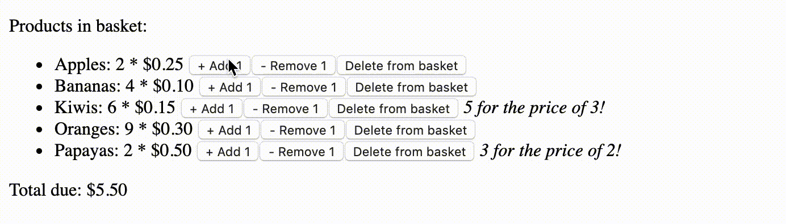

> This repo contains my result of a code challenge I did in one of my past lives. A functional basket had to be built **without front-end frameworks** (so just barebones HTML, CSS & JavaScript), **within 4 hours** (I spent 2h 50m), and had to adhere to various requirements (sell certain fruits with certain discounts, etc).

---



---

# Basket POC

Basket proof of concept.

## Instructions

```bash
npm install # Install dependencies
npm run start-api # Start mock API
npm start # Start client
```

[http://localhost:8080](http://localhost:8080)

## Comments

### Reasoning: general notes

The code contained in this package has been optimised for simplicity to provide for a high throughput of features within the total time spent. 

I’ve not used any code pre-processing packages (e.g. Webpack, Babel) as they would take more time to configure properly than would be reasonable for an application which has as its main purpose to function as a *proof of concept*.

In a real life scenario, the current state of the code would provide a good starting point for further improvements according to clarified/expanded specifications; there’s still a good amount of time left within the time originally timeboxed (which was 4 hours). 

Please view my inline comments (notes) for reasoning considering various parts of the code.

### Known limitations

This code has been _tested_ by myself, in my local dev environment, using Node 8.9.4, NPM 5.5.1 and the latest Chrome browser at the time of writing (5th of March 2018; 64.0.3282.186). Please note that: 
* Though the code has been _tested_, separate _tests_ have not been written
* Some relatively recent JS features are used in the non-transpiled file `public/script.js` which might not be supported by all browsers, most notably the Fetch API which has not (yet) been implemented in IE11. 

### Possible improvements/expansions

In order to allow for business adoption the code should be abstracted further into neatly defined separate parts, e.g. separate and generalised functions for fetching data and updating the interface. This would then also allow for: 
* The writing of (unit) tests
* The writing proper documentation (e.g. with JSDoc)

Other improvements would heavily depend on the context in which the app would be used. Two examples: 
1) If the main purpose would be to test the UI/UX of the basket, cross-browser compatibility and performance tests should be done and acted upon (e.g. usage of the Fetch API would probably not suffice in a real-world, public-facing app - a polyfill would be required, or a fully fledged code transpiler such as Babel).
2) If the main purpose would be to check for robustness of the external checkout logic, some product schema should be added to allow for a larger variety of basket content generation, rather than the fixed product types we currently have. 

And of course there’s a plethora of other possible improvements imaginable, among which an expansion and separation of the client and server mock into different repos entirely, configuration/adoption of some kind of CI environment, more sophisticated code through the addition of code (pre-)processors/transpilers, etc.
